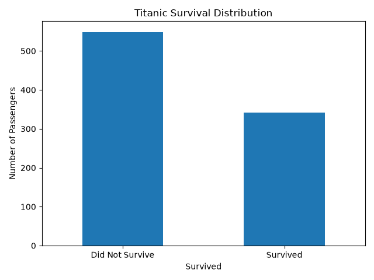
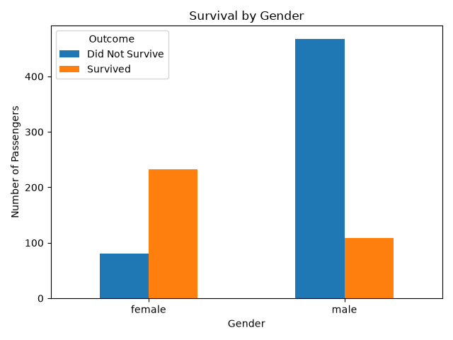
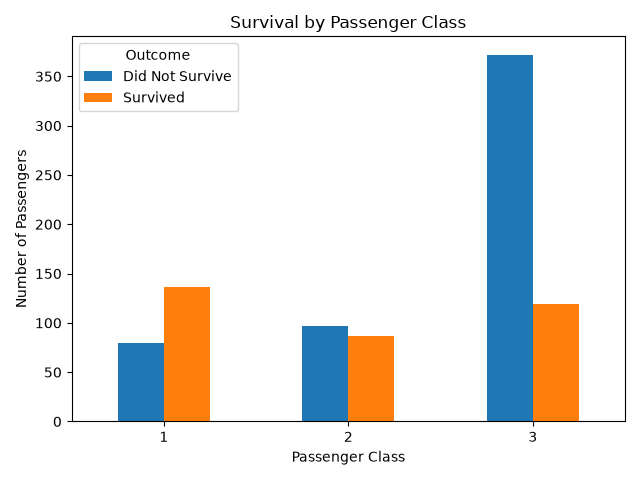

# Titanic-Survival-Prediction-Project

A beginner-friendly machine learning project that predicts whether a passenger
survived the Titanic disaster, based on features like age, sex, class, and fare.
## Overview
This project walks through a complete, simple ML workflow: loading data,
cleaning it, engineering features, training a model, and evaluating it.

## Problem Statement
Given information about a Titanic passenger (age, sex, ticket class, fare paid,
family aboard, etc.), predict whether they survived (1) or did not survive (0).
This is a binary classification problem.
## Dataset
- Source: [Titanic dataset on Kaggle](https://www.kaggle.com/c/titanic/data)
## Approach
- Data cleaning: filled missing `Age` with median, missing `Embarked` with
  the most common port, dropped `Cabin` (too many missing values), dropped
  `Name`/`Ticket`/`PassengerId` (not useful for a simple model)
- Feature engineering: created `FamilySize` (siblings/spouses + parents/children + self)
  and `IsAlone`; encoded `Sex` and `Embarked` as numbers
- Model: Logistic Regression (simple, fast, and easy to interpret — a great
  first model for a classification problem)
- Evaluation: accuracy, confusion matrix, precision/recall/F1
## Results
Results will vary slightly depending on the random split, but on the real
Kaggle Titanic dataset, Logistic Regression with this approach typically
achieves ~78–80% accuracy on the test split.
## Tech Stack
Python, Pandas, NumPy, scikit-learn, joblib
## Exploratory Data Analysis

### Survival Distribution



### Survival by Gender



### Survival by Passenger Class


## Model Comparison

I compared three machine learning models using the same train-test split:

| Model | Accuracy |
|---|---:|
| Logistic Regression | 80.45% |
| Decision Tree | 75.42% |
| Random Forest | 81.56% |

### Best Performing Model

The **Random Forest** model achieved the highest accuracy among the three models tested.
## Kaggle Results

The final Logistic Regression model was submitted to the Kaggle Titanic competition.

| Metric | Score |
|---|---:|
| Local Validation Accuracy | 80.45% |
| Kaggle Public Score | 0.75358 |

The difference between the local validation accuracy and Kaggle score is expected because the two evaluations use different datasets.

## How to Run

### 1. Clone the repository

```bash
git clone https://github.com/Bishu010/Titanic-Survival-Prediction-Project.git
cd Titanic-Survival-Prediction-Project
```

### 2. Install the required dependencies

```bash
pip install -r requirements.txt
```

### 3. Run Exploratory Data Analysis

```bash
python src/eda.py
```

The EDA script generates visualizations inside the `plots/` folder.

### 4. Train the model

```bash
python src/train.py
```

This will:

- Load and preprocess the Titanic dataset
- Engineer additional features
- Train a Logistic Regression model
- Evaluate the model
- Save the trained model and scaler
- Generate `submission.csv` for Kaggle

### 5. Compare machine learning models

```bash
python src/model_comparison.py
```

This compares Logistic Regression, Decision Tree, and Random Forest models.

## Requirements

- Python 3.10+
- pandas
- numpy
- scikit-learn
- matplotlib
- joblib
